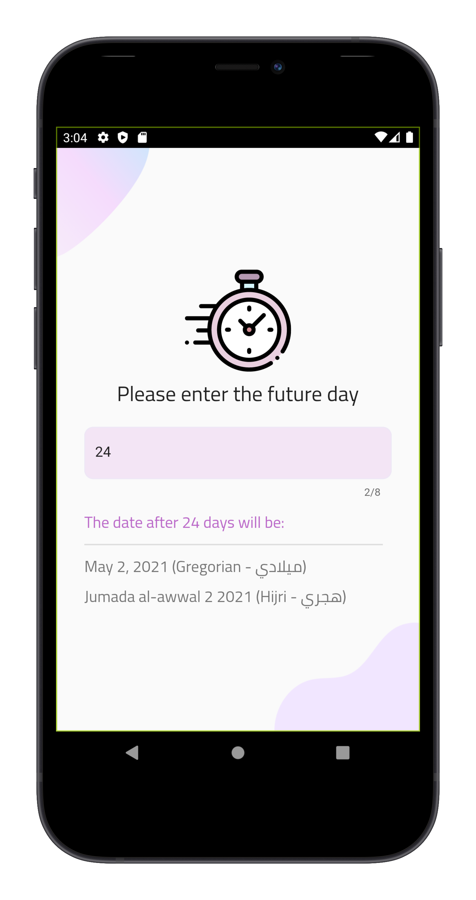

# Upcoming Date
An application developed using flutter SDK where the user enters the number of days and the application displays the date after (number of days entered) from the current day.

## Screenshot
<table>
  <tr>
    <td>  </td>
    </tr>
  </table>

